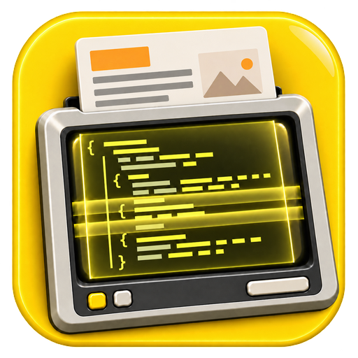

# X-Ray.Content

[](https://www.nuget.org/packages/X-Ray.Content/)
[](https://www.nuget.org/packages/X-Ray/)
[](dotnet/THIRD_PARTY_NOTICES.md)

Content extraction for .NET. Point it at a document — Office, PDF, HTML, email, an archive —
and get back the text, metadata, tables, images and a structured element tree, in whichever
output format you ask for.

`X-Ray.Content` is the content-extraction package of the **X-Ray** family of .NET libraries.
Extraction is **pure managed**: no P/Invoke, no native binaries, portable anywhere .NET runs.
The optional OCR pass is the one documented exception, and it is off by default.

## Install

```sh
dotnet add package X-Ray.Content
```

Or take the whole family through its umbrella package:

```sh
dotnet add package X-Ray
```

[**`X-Ray`**](https://www.nuget.org/packages/X-Ray/) is the family's **root package**. It
contains no code — installing it pulls in every X-Ray package, so a consumer who wants all of
them writes one line instead of tracking the list as it grows.

| Package | What it is |
|---|---|
| [`X-Ray`](https://www.nuget.org/packages/X-Ray/) | The umbrella. No code; installs every member below. |
| [`X-Ray.Content`](https://www.nuget.org/packages/X-Ray.Content/) | Content extraction. The subject of this README. |

Reach for `X-Ray.Content` directly if it is all you need — nothing is lost by doing so, and a
future family member cannot then arrive in your build without you asking for it. Reach for
`X-Ray` when you want the family to grow with you.

Package ids are hyphenated; the API lives under the `XRay.Content` namespace, since a hyphen is
not valid in a C# identifier. Targets `net10.0`.

## Extract a document

```csharp
using XRay.Content.Core;

var extractor = new Extractor();

var result = extractor.Extract(
    ExtractInput.FromUri("quarterly-report.pdf"),
    new ExtractionConfig { OutputFormat = OutputFormat.Markdown });

var doc = result.Results[0];

Console.WriteLine(doc.MimeType);      // application/pdf
Console.WriteLine(doc.Content);       // the rendered Markdown
Console.WriteLine(doc.Metadata.Title);
Console.WriteLine(doc.Tables.Count);
```

Bytes work the same way when you already hold the file:

```csharp
var input = ExtractInput.FromBytes(bytes, "application/vnd.openxmlformats-officedocument.wordprocessingml.document");
```

`Extract` never throws for a bad document: a failure lands in `result.Errors` with a type and
code, and an unsupported MIME type comes back as an empty document carrying a
`ProcessingWarning`. `ExtractAsync` is available for the same call.

## Output formats

`OutputFormat` selects how `ExtractedDocument.Content` is rendered — the extracted document
model is the same either way:

| Format | Value |
|---|---|
| Plain text (default) | `OutputFormat.Plain` |
| Markdown (GFM) | `OutputFormat.Markdown` |
| HTML | `OutputFormat.Html` |
| Djot | `OutputFormat.Djot` |
| JSON section tree | `OutputFormat.Json` |
| Structured element list | `OutputFormat.Structured` |
| DocTags | `OutputFormat.DocTags` |

Set `IncludeDocumentStructure = true` to also get the `Document` heading tree, and
`ResultFormat.ElementBased` to get the flat element stream instead of one rendered string.

## Formats it reads

48 extractors, covering 97 MIME types across 128 file extensions:

- **Office** — Word, Excel, PowerPoint (modern and legacy binary), OpenDocument, RTF,
  WordPerfect, HWP/HWPX, iWork
- **PDF** — text, geometry, tables, form fields, bookmarks, page labels, XMP
- **Markup & web** — HTML, XML, Markdown, MDX, Djot, AsciiDoc, reStructuredText, Org, Typst,
  LaTeX, DocBook, JATS, OPML
- **Email** — EML, MSG, PST
- **Books** — EPUB, FictionBook
- **Data** — CSV/TSV, DBF, JSON/JSONL, YAML, TOML, Jupyter notebooks
- **Academic** — BibTeX and citation formats
- **Subtitles** — WebVTT
- **Images** — metadata and EXIF (pixels are read only by the opt-in OCR pass)
- **Archives** — ZIP, TAR, 7z, GZip, extracted recursively as child documents
- **Source code** — resolved by extension or shebang

## Optional OCR

Off by default. Turning it on is the only way this package loads native code:

```csharp
var config = new ExtractionConfig
{
    Ocr = new OcrOptions { Mode = OcrMode.ScanOnly },   // or AllImages
};
```

`ScanOnly` recognises the PDF pages a scan detector flags. `AllImages` also reads every
embedded image and inserts its text inline after the image it came from. OCR is **additive** —
native text is never replaced — and **never fatal**: a missing checkpoint, an undecodable
image, or a recognition that outruns its timeout becomes a `ProcessingWarning`, not an
exception. A document is not a failure for lacking OCR.

Enabling it loads [PaddleOCR](https://github.com/theolivenbaum/PaddleOCR/), which brings
SkiaSharp, and `PaddleOCR.Pdf`, which brings PDFium to rasterise scanned pages. A caller that
never sets `Ocr` loads neither. Nothing is downloaded on your behalf: point
`OcrOptions.ModelDirectory` at a checkpoint you already have.

## Repository layout

```
dotnet/
  src/XRay.Content/   the content-extraction package
  src/XRay/           the X-Ray umbrella package (dependencies only, no code)
  tests/, tools/      unit tests, the corpus parity runner, dev helpers
.reference/           the upstream Xberg tree, verbatim — not built, not published
test_documents/       the fixture corpus (submodule; binaries fetched separately)
CLAUDE.md             architecture, scope, porting conventions
.devops/              the Azure Pipelines job that publishes the family
```

Both packages ship from one pipeline run at one version, which is what keeps the umbrella's
dependency on `X-Ray.Content` pinned to the same commit.

## Building from source

```sh
cd dotnet
dotnet build XRay.Content.sln -c Release
dotnet test  tests/XRay.Content.Tests/XRay.Content.Tests.csproj -c Release
```

A handful of tests read binary fixtures from the `test_documents` corpus, which is not in git:

```sh
git submodule update --init --depth 1 test_documents
python3 test_documents/scripts/fetch_corpus.py     # ~580 MiB, re-runnable
```

`tools/XRay.Content.TestRunner` runs the whole corpus and diffs each fixture against a golden
reference, which is the primary parity signal:

```sh
dotnet run --project tools/XRay.Content.TestRunner -c Release -- ../test_documents --ext docx --diff
```

See [`CLAUDE.md`](CLAUDE.md) for the architecture, the porting conventions and how
goldens are regenerated, and [`dotnet/TODO.md`](dotnet/TODO.md) for per-format status.

## Relationship to Xberg

This repository is a fork of **[xberg-io/xberg](https://github.com/xberg-io/xberg)**, a polyglot
document-intelligence framework with a Rust core. `X-Ray.Content` is a **native C# port** of its
extraction engine — every extractor, type and renderer reimplemented in managed C#, not a
wrapper over the Rust library or a binding to it.

The whole upstream tree is retained under [`.reference/`](.reference), byte-identical and
deliberately untouched, so upstream work can be pulled in and the port re-derived against it.
Nothing there is built, published, or part of this package — see
[`.reference/UPSTREAM.md`](.reference/UPSTREAM.md) for its sync state, and
[`.claude/skills/sync-upstream-reference`](.claude/skills/sync-upstream-reference/SKILL.md) for how
upstream commits are replayed onto it. For the Rust engine, its CLI and server, and its bindings
for Python, Node, Go, Java, C# and others, use the upstream project itself and
[docs.xberg.io](https://docs.xberg.io).

Upstream also publishes `XbergIo.Xberg` on NuGet. That is an FFI binding over the Rust core and
is unrelated to this package — different implementation, different maintainers.

## Scope

Content extraction only. Audio and video transcription, embeddings, NER, LLM-backed structured
extraction, reranking, chunking-for-RAG, keyword extraction and the REST/MCP server modes are
all upstream features that this port deliberately does not carry.

## License

`MIT AND Apache-2.0`. The port is MIT, except for a handful of files that are derivative works
of Apache-2.0-only Rust crates and remain under that license — see
[`dotnet/THIRD_PARTY_NOTICES.md`](dotnet/THIRD_PARTY_NOTICES.md) for exactly which files and
which upstreams. The retained upstream tree is MIT, © Kreuzberg, Inc.; see [`LICENSE`](LICENSE).
